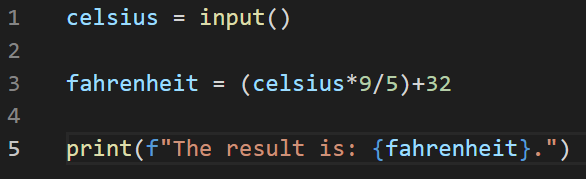

# Leo Tran T1A1-Workbook
## Xuan Lap TRAN (CA-15153)


### Q1: **Identify** and **explain** common and important components and concepts of web development markup languages.
---


### Q2:	**Define** the features of the following technologies that are essential in terms of the development of the internet:
### - packets
### - IP addresses (IPv4 and IPv6)
### - routers and routing
### - domains and DNS

### **Explain** how each technology has contributed to the development of the internet.
---


### Q3:	**Define** the features of the following technologies that are essential in terms of the development of the internet:
### - TCP
### - HTTP and HTTPS
### - web browsers (requests, rendering and developer tools)

### **Explain** how each technology has contributed to the development of client and server communication over the internet (50 - 150 words for each technology)
---


### Q4: **Identify** THREE data structures used in the Python programming language and **explain** the reasons for using each.
---


### Q5: **Describe** the features of interpreters and compilers and how they are different.
---


### Q6: **Identify** TWO commonly used programming languages and **explain** the benefits and drawbacks of each.
---


### Q7: **Identify** TWO ethical issues from the areas below and **discuss** the extent to which an IT professional is ethically responsible in terms of the issue.

### List of topics containing ethical issues:
 - access to a user’s personal information (medical, family, financial, personal attributes such as sexuality, religion, or beliefs)
 - intellectual property, copyright, and acknowledgement.
 - criminal acts such as theft, fraud, trafficking and distribution of prohibited substances, terrorism
 - GPS tracking data and other types of metadata, MAC addresses, hardware fingerprints
 - freedom of thought, conscience, speech and the media
 - aggressive sales and marketing practices designed to mislead and deceive consumers
 - trading of shares on the stock exchange OR crypto-currencies

### For each ethical issue identify a source of legal information relating to the ethical issue and discuss whether the law is helpful in assisting a developer to act in an ethical way. (Word count guide: 200 words max)

### Conduct **research** into a case study of **ONE** of the ethical issues you have chosen **discuss** how an ethical IT professional should respond to the case study and how they might mitigate or prevent ethical breaches. (Word count guide: 400 - 600 words)
---


### Q8: Explain control flow, using examples from the Python programming language
---


### Q9: Explain the difference between type coercion and type conversion. Are either of these used in Python?
---


### Q10: Explain data types, using examples:
---


### Q11: Here’s the problem: “There is a restaurant serving a variety of food. The customers want to be able to buy food of their choice. All the staff just quit, how can you build an app to replace them?”
### - Identify the classes you would use to solve the problem
### - Write a short explanation of why you would use the classes you have identified
---


### Q12: Identify and explain the error in the code snippet below that is preventing correct execution of the program


---


### Q13: The code snippet below looks for the first two elements that are out of order and swaps them; however, it is not producing the correct results. Rewrite the code so that it works correctly.


---


```
AAA
```


### Q14: Demonstrate your algorithmic thinking through completing the following two tasks, in order:
 1. Create a flowchart to outline the steps for listing all prime numbers between 1 and 100 (inclusive). Your flowchart should make use of standard conventions for flowcharts to indicate processes, tasks, actions, or operations
 2. Write pseudocode for the process outlined in your flowchart
---


 ```
AAA
 ```


### Q15: Write pseudocode OR Python code for the following problem:
*You have access to two variables: raining (boolean) and temperature (integer). If it’s raining and the temperature is less than 15 degrees, print to the screen “It’s wet and cold”, if it is less than 15 but not raining print “It’s not raining but cold”. If it’s greater than or equal to 15 but not raining print “It’s warm but not raining”, and otherwise tell them “It’s warm and raining”*.

---

```
ABC
```


### Q16: ACME Corporation are hiring a new junior developer, as part of their hiring criteria they've created a "coding skill score" based on the specific competencies they require for this role; the more important the skill is for ACME corp, the more points it contributes to the "coding skill score" The skills are weighted as follows:
- Python (1)
- Ruby (2)
- Bash (4)
- Git (8)
- HTML (16)
- TDD (32)
- CSS (64)
- JavaScript (128)

#### **Write a program that allows a user to input their skills and then tells them:**

- a) Their overall "coding skill score" 
- b) Skills they may want to learn, and how much each one would improve their score
---

```
ABC
```


# References:

### Q1


### Q2


### Q3


### Q4


### Q5


### Q6


### Q7


### Q8


### Q9


### Q10


### Q11


### Q12


### Q13


### Q14


### Q15


### Q16

