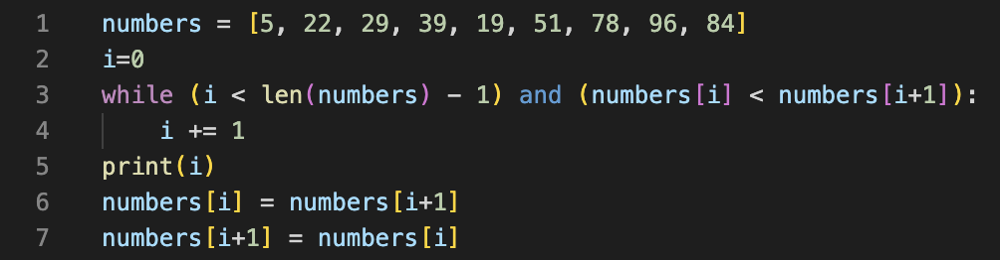

# Leo Tran T1A1-Workbook
## Xuan Lap TRAN (CA-15153)


## Q1: **Identify** and **explain** common and important components and concepts of web development markup languages.

Markup languages serve as the hidden framework supporting various computer tasks, including message sending, document viewing, and internet browsing.

For Web Development, the most basic and commonly-used markup language for web development is HTML, or HTML5 for the current version. HTML use tags or symbols, and elements to describe the structure and presentation of web content. The tags or symbols are usually enclosed in angle brackets <> and </>, such as `<tag> </tag>`. The content between the **opening and closing tags** is the **element content**, which can be text, images, links, or other elements.

**Elements** can have **attributes**, which are additional information that can be added to the opening tag to modify the element’s behavior or appearance. **Attributes** are specified using the syntax name=“**value**”. For example, `` is an element that displays an image, and it has two attributes: src and alt. The src attribute specifies the source of the image, and the alt attribute specifies the alternative text in case the image cannot be displayed.

### HTML Elements


### Basic HTML Sample:
```html
<!DOCTYPE html>
<html lang="en">
<head>
    <meta charset="UTF-8">
    <meta name="viewport" content="width=device-width, initial-scale=1.0">
    <title>Document</title>
</head>
<body>
    
</body>
</html>
```


### **Some of the most common markup languages for web development are HTML, XML, and XHTML.**

**HTML** stands for **HyperText Markup Language**, the most basic and commonly-used markup language for web development. It defines the meaning and structure of web content using elements and attributes. HTML supports scripting languages, such as JavaScript. However, HTML can only create static web pages and has limited security features.

**XML** stands for ***eXtensible Markup Language**. It is a markup language that defines a set of rules for encoding documents in a format that is both human-readable and machine-readable. XML is designed to store and transport data, not to display it. XML elements can have any name and structure, as long as they follow the XML syntax rules. XML also supports namespaces, schemas, and stylesheets to define the meaning and presentation of XML documents. XML can be used with other technologies, such as XSLT, XPath, XQuery, and AJAX, to manipulate and display data.

**XHTML** stands for **eXtensible HyperText Markup Language**. It is a markup language that combines the features of HTML and XML. XHTML is a stricter and cleaner version of HTML, which follows the XML syntax rules. XHTML elements must be well-formed, meaning that they must have a closing tag, be nested properly, and be lowercase. XHTML also supports namespaces, schemas, and stylesheets to define the meaning and presentation of XHTML documents.

### **Other types of languages that are supported by HTML are:**

**CSS**: stands for **Cascading Style Sheets** - a language used to style HTML elements, such as colors, fonts, layouts, animations, etc. 

**JavaScript**: is a scripting language that is used to add interactivity and functionality to HTML pages.

**MathML**: stands for **Mathematical Markup Language** used to display mathematical expressions and symbols in HTML pages. MathML can be implemented in HTML using CSS or JavaScript.

**SVG**: stands for **Scalable Vector Graphics** - a markup language used to display vector graphics in HTML pages. Same as MathML, SVG can be applied using CSS or JavaScript.

### **The benefits of using HTML5 vs HTML(4) are:**

HTML5 provides native support for audio and video elements.

HTML5 provides new meaningful semantic elements, such as header, footer, nav, article, section, etc.

HTML5 provides new form elements and attributes, such as “email”, “date”, “range”, datalist, output, etc.

HTML5 provides new APIs, such as Web Storage, Web Workers, Drag and Drop, Geolocation etc.

HTML5 is more mobile-friendly and responsive.


## Q2:	**Define** the features of the following technologies that are essential in terms of the development of the internet:
### - packets
### - IP addresses (IPv4 and IPv6)
### - routers and routing
### - domains and DNS

### **Explain** how each technology has contributed to the development of the internet.
---

### 1. Packets

A packet is like a small piece of a larger message that is sent over the internet. For example, when you want to see a web page, the web page is divided into many packets and sent to your computer, which then puts them back together. Packets have some information at the beginning and the end that tell where they came from and where they are going, and what order they are in. Packets has contributed to the development of the internet by making it easier and faster to send data over the internet, because they can take different paths, be rerouted in case of congestion, and share the network with other packets.

### 2. IP addresses (IPv4 and IPv6)

An IP address is a unique number or code that identifies a device on the internet. It is like a postal address that tells where to deliver the packets. For example, 192.168.0.1 is an IP address. IP addresses help to route the packets to the right device on the internet. There are two types of IP addresses: IPv4 and IPv6. IPv4 uses four numbers separated by dots, and can have about 4.3 billion possible addresses. IPv6 uses eight groups of numbers and letters separated by colons, and can have about 340 undecillion possible addresses. IPv6 was created to solve the problem of running out of IPv4 addresses, and also has some other benefits such as better security and mobility. IP addresses (IPv4 and IPv6) have contributed to the development of the internet by providing a way to identify and communicate with any device connected to the network.

#### Key Differences between IPv4 and IPv6
1. IPv4 is a 32-Bit address, whereas IPv6 is a 128-Bit address.
2. IPv4 is a numeric addressing method, whereas IPv6 is an alphanumeric addressing method.
3. IPv4 binary bits are separated by a dot(.), whereas IPv6 binary bits are separated by a colon(:).
4. Encryption and Authentication are provided in IPv6, but not in IPv4.


### 3. Routers and Routing

A router is a device that connects and directs data packets between different networks on the internet. A router uses an internal routing table, a list of paths to various network destinations, to determine where to send each packet. A router reads a packet’s header to see its intended destination, then consults the routing table to figure out the most efficient path to that destination. It then forwards the packet to the next network in the path. Routers and routing have contributed to the development of the internet by enabling data packets to travel across multiple networks and reach their destinations.

### 4. Domains and DNS

1. **Domains:**

    A **domain** is a piece of text that helps to show a website or server on the internet. In other words, a domain is a word or phrase that helps to identify a specific website on the internet. For example, google.com is a domain name. A domain name consists of two or more parts separated by dots. For example, the address mail.google.com splits into three parts:

    - Top-level domain (com). This is the most general part of the domain name, and it indicates the type or category of the website. For example, .com stands for commercial, .org stands for organization, .edu stands for education, etc.

    - Second-level domain (google). This is the main part of the domain name, and it usually represents the name of the website or the organization that owns it. For example, google is the name of the search engine owned by Google LLC.

    - Subdomain (mail). This is an optional part of the domain name, and it usually indicates a specific section or service of the website. For example, mail is a subdomain of google that provides email service.

2. **DNS:**

    A **DNS** is a system that stores and manages domain information in a distributed database. The main function of a DNS is to convert domain names into IP addresses and vice versa. DNS makes it possible to use easy-to-remember domain names instead of IP addresses for each website. For example, DNS converts and matches the domain google.com to the IP address 142.250.66.206.

Domains and DNS have contributed to the development of the internet by translating domain names to IP addresses and vice versa, making the internet more accessible, user-friendly, and flexible. They also provide other functions, such as email routing, load balancing, and security.


## Q3:	**Define** the features of the following technologies that are essential in terms of the development of the internet:
### - TCP
### - HTTP and HTTPS
### - web browsers (requests, rendering and developer tools)

### **Explain** how each technology has contributed to the development of client and server communication over the internet (50 - 150 words for each technology)
---

### 1. TCP

- Transmission Control Protocol (TCP) is a set of rules that makes sure data is sent and received correctly over the internet. TCP checks for errors, missing parts, and duplicates in the data. TCP helps computers and devices talk to each other reliably and securely over different kinds of networks. TCP has contributed to the development of client and server communication over the internet by enabling reliable and secure data transfer across different types of networks and devices.

### 2. HTTP and HTTPS

- Hypertext Transfer Protocol (HTTP) is the primary protocol of sending data between a web browser and a website. HTTP tells how the data should be formatted and what the browser and the website should do with it. HTTP helps people exchange information and multimedia over the web.

- Hypertext Transfer Protocol Secure (HTTPS) is a more secure version of HTTP that uses encryption to protect the data from being spied on, changed, or attacked.

- HTTP has contributed to the development of client and server communication over the internet by providing a standard and flexible way of exchanging information and multimedia over the web, While HTTPS has helped in further enhancing the security and privacy of web transactions and increasing user trust.

### 3. Web browsers:

- Web browsers are programs that let you see and use web pages on the internet. They do three things:

    - **Requests**: Web browsers send requests to web servers using protocols such as HTTP or HTTPS, and receive responses that contain the data and resources of the web pages.

    - **Rendering**: Web browsers parse and interpret the data and resources of the web pages, such as HTML, CSS, and JavaScript, and display them on the user’s screen using a rendering engine.

    - **Developer tools**: Web browsers provide tools for web developers to inspect, debug, and modify the web pages, such as console, inspector, debugger, and network monitor.

Web browsers have contributed to the development of client and server communication over the internet by providing a user-friendly interface for accessing and interacting with web content, supporting various web technologies and standards, and offering features and extensions that enhance the functionality and performance of web applications.


## Q4: **Identify** THREE data structures used in the Python programming language and **explain** the reasons for using each.

There are two common types of Data structures in Python: Built-in Data Structures and User-Defined Data Structures. Simply put, one is designed in the language (built-in) and the other is defined by user, enabling user to have full control over the functionalities they want.


The most common Data structures are then the Built-in, which are the below 4 data structures:

1.	**List**

A list is a mutable, ordered sequence of items that can store elements of different types. Lists are created using square brackets `[]`. Lists are used for storing and manipulating collections of data, such as sorting, slicing, appending, etc. Lists are also the basis for other data structures, such as stacks and queues.

2.	**Tuple**

A tuple is an immutable, ordered sequence of items that can store elements of different types. Tuples are created using parentheses `()`. Tuples are used for storing and returning multiple values from a function, swapping variables, creating dictionary keys, etc. Tuples are faster and more memory-efficient than lists.

3.	**Dictionary**

A dictionary is a mutable, unordered collection of key-value pairs that can store elements of different types. Dictionaries are created using curly braces `{}` and in Key-Value pair basic, separated by a comma with first element be the key and second element be the value. Example: 

```python
Dictionary = {'Name': 'Leo', 1: [15, 7, 9, 3,]}


print(Dictionary['Name'])
--> Leo
print(Dictionary[1])
--> [15, 7, 9, 3]

```

Dictionaries are used for mapping and retrieving data by keys, such as storing employee records, counting word frequencies, implementing hash tables, etc. Dictionaries are optimized for fast lookups and insertions.

4.	**Set**

A set is a mutable, unordered collection of unique items that can store elements of different types. Sets are created using curly braces `{}`. Sets are used for performing mathematical operations, such as union, intersection, difference, etc. Sets are also used for removing duplicates, testing membership, finding common elements, etc. Sets are faster than lists for checking if an element is present.


## Q5: **Describe** the features of interpreters and compilers and how they are different.

1. **Interpreters**

Interpreters are programs that read and run the code line by line, without saving it as a file. Interpreters make it easy to find and fix errors, as they show them as they happen. Interpreters also take care of the memory for you, so you don’t have to worry about memory errors. Interpreters can work on different platforms without changing the code. However, interpreters are slower than compilers, as they have to read the code every time it is run. Interpreters also need more memory, as they keep the intermediate code in the memory. Python, Ruby, and JavaScript are some languages that use interpreters.

2. **Compilers**

Compilers are programs that convert the whole code into machine code before running it, and save it as a file. Compilers are faster than interpreters, as they only have to convert the code once, and then run the machine code directly. Compilers also protect the code from being seen by others. Compilers also have debugging tools, which help in solving errors quickly. However, compilers are harder to debug, as they only show errors after the whole code is converted. Compilers also need more time and disk space, as they have to scan and compile the whole code. C, C++, and Java are some languages that use compilers.


## Q6: **Identify** TWO commonly used programming languages and **explain** the benefits and drawbacks of each.

### 1. Python

**Python** is a general-purpose, high-level, interpreted, and dynamically typed programming language that has a simple and elegant syntax. It has a simple way of writing code that is easy to read and understand. It can work with different ways of coding, like objects, functions, and commands. It can run on different systems and devices. It can do many things, like math, science, web, and more.

- **Benefits**:

    - It is simple and clear, so you can learn and use it well.
    - It has many helpful tools and people that can help you with your code.
    - It is versatile and powerful, as it can handle complex and diverse problems with ease and efficiency.

- **Drawbacks**:
    - It is slow and not good for some tasks that need speed and power, like games or graphics.
    - It has some problems with doing things at the same time, like running multiple codes at once.
    - It has some confusing and weird parts, like how to make code blocks, how to switch between cases, and how to format text.

### 2. JavaScript

**JavaScript** is a scripting, high-level, interpreted, and dynamically typed programming language that is mainly used for creating dynamic and interactive web pages. It can change the web page, talk to the web server, and store data. It can run both on the client-side (browser) and the server-side (Node.js). It has many cool and useful tools and features, like React, Angular, jQuery, Bootstrap, and more. It can work with different ways of coding, like objects, functions, and events.

- **Benefits**:

    - It is the most common and supported language for web development, as it can make web pages more dynamic and interactive.
    - It is versatile and flexible, as it can be used for many purposes, like web, mobile, desktop, games, and more.
    - It is expressive and dynamic, as it allows developers to create complex and creative solutions with less code and more freedom.

- **Drawbacks**:
    - It is not very consistent and reliable, as it has many mistakes and traps, like how to end a line, how to change types, how to scope variables, and how to compare values.
    - It is not very secure, as it can be easily hacked and misused by bad people, especially on the browser, where the code is visible and open.
    - It is not very efficient, as it uses a lot of memory and resources, especially for big and complex applications, because it runs on one thread and waits for events.


## Q7: **Identify** TWO ethical issues from the areas below and **discuss** the extent to which an IT professional is ethically responsible in terms of the issue.

### List of topics containing ethical issues:
 - access to a user’s personal information (medical, family, financial, personal attributes such as sexuality, religion, or beliefs)
 - intellectual property, copyright, and acknowledgement.
 - criminal acts such as theft, fraud, trafficking and distribution of prohibited substances, terrorism
 - GPS tracking data and other types of metadata, MAC addresses, hardware fingerprints
 - freedom of thought, conscience, speech and the media
 - aggressive sales and marketing practices designed to mislead and deceive consumers
 - trading of shares on the stock exchange OR crypto-currencies

### For each ethical issue identify a source of legal information relating to the ethical issue and discuss whether the law is helpful in assisting a developer to act in an ethical way. (Word count guide: 200 words max)

### Conduct **research** into a case study of **ONE** of the ethical issues you have chosen **discuss** how an ethical IT professional should respond to the case study and how they might mitigate or prevent ethical breaches. (Word count guide: 400 - 600 words)
---

### Access to personal information:

Users’ personal data, such as their health, finances, or preferences, is valuable and sensitive. IT professionals have an ethical duty to protect this data from hackers or misuse by others. They also have an ethical duty to respect the users’ consent and preferences regarding how their data is collected, stored, shared, and used. For example, they should inform the users about the purpose and scope of data collection, obtain their explicit permission before accessing their data for analysis or research purposes, and ensure that the data is encrypted and anonymized when transmitted or stored. The law provides some guidance on this issue through regulations such as the General Data Protection Regulation (GDPR) in Europe or the California Consumer Privacy Act (CCPA) in the US, which grant users certain rights over their personal data and impose obligations on businesses that collect or process it. However, these laws may not cover all aspects of data protection or address all situations that may arise in practice. Therefore, IT professionals need to be aware of the legal requirements and best practices in their jurisdictions and apply them consistently and transparently

### Trading of shares or cryptocurrencies:

Shares or cryptocurrencies are digital assets that can be traded on financial platforms. IT professionals have an ethical role to play in ensuring that these platforms are reliable, secure, fair, and compliant with relevant laws and regulations. They also have an ethical role to play in avoiding conflicts of interest or insider trading that may compromise their integrity or objectivity. For example, they should not use confidential information obtained from their employer or clients for personal gain or advantage when trading shares or cryptocurrencies on a platform that they work for or provide services to. They should also not engage in fraudulent or manipulative activities that may harm other investors or market participants. The law provides some protection against these issues through securities laws that regulate the disclosure of material information by issuers and intermediaries involved in securities transactions. However, these laws may not be comprehensive enough to cover all types of securities markets or transactions that involve digital assets such as cryptocurrencies. IT professionals should follow the law and the professional standards in their field.

### Case study: Apple vs FBI

One possible case study that I found in 2015-2016 is about the FBI’s demand that Apple help it open an iPhone of one of the shooters in an ISIS-inspired terrorist attack that killed 14 people in San Bernardino, California. The FBI attempted to gain access to the data stored on the phone but was unable to penetrate its encryption software. Lawyers for the Obama administration approached Apple for assistance with unlocking the device, but negotiations soon broke down. The Justice Department then obtained a court order compelling Apple to help the FBI unlock the phone. Apple CEO, Timothy Cook, publicly challenged the court in an open letter, sparking an intense debate over the balance between maintaining national security and protecting user privacy.

From reading the case study, we can understand the dilemma between protecting either security vs user privacy. Going one way may result in damaging the other. To think about solution and answer to this issue, I would like to use the approach of brainstorming: to start with trying to ask the right questions for IT professionals.

Some of these questions are:

- How should an IT professional balance their loyalty and duty to their employer or client with their moral obligation to respect and protect user privacy?
- How should an IT professional handle requests or demands from law enforcement or other authorities that may conflict with their ethical principles or values?
- How should an IT professional communicate and collaborate with other stakeholders, such as users, customers, regulators, media, or public opinion, when dealing with such issues?
- How should an IT professional ensure that they follow the relevant laws and regulations in each context where they operate and seek guidance from experts when necessary?

There is no definitive answer to these questions, as different situations may require different approaches and considerations. However, some possible ways that an IT professional could respond to this case study are:
- First and foremost, **check any rules and laws**.
- Conducting a thorough risk assessment before agreeing or refusing to assist law enforcement or other authorities in accessing encrypted data.
- Explaining clearly and transparently why they are unable or unwilling to comply with a court order or request from law enforcement or other authorities.
- **Seeking legal advice** from qualified professionals who can advise them on their rights and obligations under the law.
- Negotiating with law enforcement or other authorities for alternative solutions that may satisfy both parties’ interests without compromising user privacy.
- Reporting any incidents or breaches of user privacy that may occur as a result of accessing encrypted data.
- Learn and teach others. Educate themselves and others on the importance and implications of data privacy and security, as well as the legal and ethical frameworks that govern them.
- Keep up to date with the latest developments and trends in data protection and encryption technologies.
- Collaborate and communicate with other IT professionals, users, and stakeholders on data privacy and security issues, and seek their input and feedback
By following these steps, an IT professional could mitigate or prevent ethical breaches related to access to a user’s personal information. They could also demonstrate their professionalism, integrity, and responsibility as an IT expert.


## Q8: Explain control flow, using examples from the Python programming language

**Control flow** is a fundamental concept in programming that refers to the order in which individual statements, instructions, or function calls are executed or evaluated within a script or program. In Python, control flow is managed using several constructs that allow for conditional branching, looping, and handling of exceptions. Python has three types of control flow statements:
-	**conditional**,
-	**iterative**, and
-	**transfer**.

### 1. Conditional statements:

**Conditional statements** are used to execute different blocks of code depending on the outcome of a condition. The condition is always evaluated to either True or False. Python supports the following conditional statements:

- `if` statement: executes a block of code if the condition is True, and skips it otherwise.
- `if-else` statement: executes one block of code if the condition is True, and another block of code if the condition is False.
- `if-elif-else` statement: executes one of several blocks of code based on the value of the condition or multiple conditions. The keyword elif is short for else if.
- `match` statement: executes one of several blocks of code based on the value of an expression or its type or attributes. This is a new feature introduced in Python 3.10.

### 2. Iterative statement:

**Iterative statement** are used to execute a block of code repeatedly as long as the condition is True. Python supports the following iterative statements:

- `for` statement: iterates over the items of any sequence (such as a list or a string) or any iterable object (such as a range or a generator) in the order that they appear in the sequence or object.
- `while` statement: executes a block of code as long as the condition is True.

### 3. Transfer statements:

**Transfer statements** are used to alter the normal flow of execution in a certain manner. Python supports the following transfer statements:
- `break` statement: terminates the current loop and resumes execution at the next statement after the loop.
- `continue` statement: skips the rest of the current iteration of the loop and continues with the next iteration.
- `pass` statement: does nothing and acts as a placeholder for future code.

### Examples of control flow statements:

```python
# Example of if statement
x = int(input("Please enter an integer: "))
if x < 0:
    x = 0
    print("Negative changed to zero")
elif x == 0:
    print("Zero")
elif x == 1:
    print("Single")
else:
    print("More")

# Example of for statement
words = ["cat", "window", "defenestrate"]
for w in words:
    print(w, len(w))

# Example of while statement
n = 10
while n > 0:
    print(n)
    n = n - 1
print("Blast off!")

# Example of break statement
for i in range(1, 11):
    if i == 5:
        break # exit the loop
    print(i)
print("Loop ended")

# Example of continue statement
for i in range(1, 11):
    if i % 2 == 0:
        continue # skip even numbers
    print(i)
print("Loop ended")

# Example of pass statement
def foo():
    pass # do nothing for now
```


## Q9: Explain the difference between type coercion and type conversion. Are either of these used in Python?

Simply put, type coercion is automatic, while type conversion is manual. Python does not have type coercion, but it does have type conversion using built-in functions.

***Python does not have a concept of type coercion in the strict sense**, as it does not force any object to be converted to another type without user involvement. However, Python does perform some implicit type conversions when certain operations are applied on objects that have different types.
- For example, when adding or subtracting two numbers, Python will coerce the operands to the same numeric type before performing the operation. Similarly, when comparing two objects for equality or inequality, Python will coerce them to the same object type before comparing them.
    ```python
    x = 5
    print(type(x)) #--> <class 'int'>
    y = 6.7
    print(type(y)) #--> <class 'float'>
    z = x + y
    print(z) #--> 11.7
    print(type(z)) #--> <class 'float'>
    ```

### 1. Type Coercion:

Type coercion refers to the automatic conversion of one data type to another by the programming language itself, typically during an operation or evaluation. It occurs without explicit instructions from the programmer. The purpose of type coercion is to ensure that operations between different data types can be performed, even if the types are not compatible.

### 2. Type Conversion:

Type conversion is the manual conversion of one data type to another by the programmer. It involves explicitly instructing the programming language to change the data type from one form to another. Type conversion typically requires the use of specific functions or syntax provided by the programming language.

In Python, you can use built-in functions such as int(), float(), str(), etc., to convert one data type to another. This is also called explicit type conversion or type casting.


## Q10: Explain data types, using examples

Data types are an essential concept in programming that define the type of data that can be stored and manipulated within a program. Each data type has specific characteristics, operations, and memory requirements associated with it.

There are too many data types in different programming languages and applications, and it would be impossible to cover them all in one go. However, we can go through some examples of common data types in one particular programming language Python below.

### Here are some example of data types in Python Language:


| Category          | Data Type             | Description       | Example       | 
| -----------       | -----------           | ----------- | ----------- |
| Text Type         | str                   | Data Type |x = "Hello World" |
| Numeric Types     | int, float, complex   | 	A whole number, a decimal number, or a complex number respectively  | x = 10  |
| Sequence Types    | list, tuple, range    | An ordered collection of items that can be modified  | x = [1, 2, 3]  |
| Mapping Type      | dict                  | An unordered collection of key-value pairs that can be accessed by keys  | x = {"name": "Alice", "age": 25}  |
| Set Types         | set, frozenset        | 	A collection of unique items that supports mathematical operations  | x = {1, 2, 3}  |
| Boolean Type      | bool                  | 	A logical value that can be either True or False  | x = True    |
| Binary Types      | bytes, bytearray, memoryview | A sequence of bytes that can be manipulated as binary data  | x = b"Hello"  |
| None Type         | NoneType              | NoneType | x = None  |


## Q11: Here’s the problem: “There is a restaurant serving a variety of food. The customers want to be able to buy food of their choice. All the staff just quit, how can you build an app to replace them?”
### - Identify the classes you would use to solve the problem
### - Write a short explanation of why you would use the classes you have identified
---

Running a restaurant business is hard, running it without any kind of human staff sounds pretty impossible.

To cover all aspects of running a restaurant business, I would first look at the **Assumptions**:
1. All staff quit their job, including chef who prepares the food,
2. We are not allowed to participate in any human work, including chef and management, and
3. Create an app that basically does all that.
4. Bot/Robot is not mentioned, hence not a restriction --> can be programmed to replace all staff and manage the restaurant.

To solve the problem of building an app to replace the staff in a restaurant, as well as those chef work and management work, we can first brainstorm the whole picture of all possible tasks/issues/responsibilities/functionalities then assign those and identify several classes that would be useful. Here are some classes that could be used:

- **Restaurant**: This class would represent the restaurant itself and would contain information about the restaurant, such as its name, location, and menu. It would have methods to facilitate customer interactions with the menu and orders.

- **Menu**: This class would store the information about the available food items, their prices, ingredients, and categories. It would also have methods to add, remove, or update food items, and to display the menu to the customers.

- **Order**: This class would represent a customer’s order, containing the food items they have selected, the quantity, the total price, and the status (pending, confirmed, ready, delivered, etc.). It would also have methods to create, modify, or cancel an order, and to notify the customer about the status of their order.

- **Customer**: This class would store the information about a customer, such as their name, phone number, address, payment method, and preferences. It would also have methods to register, login, logout, view their order history, rate and review food items, and provide feedback.

- **Chef**: This class would simulate the role of a chef, who would prepare the food items according to the orders. It would have methods to accept, reject, or complete an order, and to communicate with the customers or the delivery agents.

- **DeliveryAgent**: This class would simulate the role of a delivery agent, who would deliver the food items to the customers. It would have methods to accept, decline, or complete a delivery task, and to update their location and availability.

- **Cleaner**: This class would simulate the role of a cleaner, who would keep the restaurant premises clean and hygienic. It would have methods to detect dirt, dust, or spills, and to clean them using appropriate tools and techniques, including kitchen and toilet areas.

- **OrderingAgent**: This class would simulate the role of an ordering agent, who would take orders from the customers through the app. It would have methods to display the menu, accept the customer’s choices, confirm the order details, and process the payment.

- **Greeter**: This class would simulate the role of a greeter, who would welcome the customers to the restaurant and guide them to their seats. It would have methods to detect the arrival of customers, greet them with a friendly message, and assign them a table number.

- **Inventory**: This class would store the information about the stock of food items, ingredients, and other supplies. It would also have methods to monitor the inventory level, order new supplies, update the stock, and generate inventory reports.

- **Finance**: This class would store the information about the income, expenses, taxes, and profits of the restaurant. It would also have methods to record transactions, calculate costs, generate invoices, and produce financial statements.

- **QualityControl**: This class would ensure the quality and safety of the food items and the service. It would have methods to inspect the food items, check the expiration dates, test the temperature, and enforce the hygiene standards.

- **Supply**: This class would manage the delivery of supplies from the vendors to the restaurant. It would have methods to place orders, track shipments, receive deliveries, and verify invoices.

- **CustomerService**: This class would handle the complaints, queries, and feedback from the customers. It would have methods to listen to the customers, resolve issues, provide refunds, and improve satisfaction.

- **Marketing**: This class would provide advice and guidance ONLY on the marketing activities of the restaurant, such as creating and posting content, engaging with customers, running ads, and measuring results. It would have methods to analyse the market, identify the target audience, suggest marketing strategies, and evaluate the outcomes.

These are some of the classes I would use to solve the problem. It looks excessive but we are considering a semi-self-managed restaurant without any staffs, which means: semi-self-service/self-service; self-delivery; self-managed. The reason I would use these classes is because they would help me to organize the data and the logic of the app in a clear and modular way. Each class would have a specific responsibility and functionality, and they would interact with each other through well-defined interfaces. This would make the app easier to design, implement, test, but remain restricted from making decision with financial impact.

## Q12: Identify and explain the error in the code snippet below that is preventing correct execution of the program

---

### Here is the provided code:

``` python
celsius = input ()

fahrenheit = (celsius* 9 / 5) + 32

print(f"The result is: {fahrenheit}.")
```

### By simply running a test, the error message is:

```python
TypeError: unsupported operand type(s) for /: 'str' and 'int'
```

The error was straightforward; the input was not converted to a data type other than the default ‘str’ before being used in an arithmetic operation. The input() function returns a string, hence no subsequent arithmetic operations can be performed.


So the solution is simply converting it into a numeric value data types by using **Type Conversion**, either int() or float(), mentioned above in Q9.

### Solution:

```python
celsius = int(input ()) # or float(input ())

fahrenheit = (celsius* 9 / 5) + 32

print(f"The result is: {fahrenheit}.")
```


## Q13: The code snippet below looks for the first two elements that are out of order and swaps them; however, it is not producing the correct results. Rewrite the code so that it works correctly.

---

### Here is the provided code:
```python
numbers = [5, 22, 29, 39, 19, 51, 78, 96, 84]
i=0
while (i < len(numbers) - 1) and (numbers[i] < numbers[i+1]):
    i += 1
print(i)
numbers[i] = numbers[i+1]
numbers[i+1] = numbers[i]
 ```
### By checking the question, the assumptionS here are:

> 1. **looks for the first two elements that are out of order and swaps them**

> 2. --> So, we won't be looking at adjusting the **ENTIRE LIST**

### **Solution**

```python
numbers = [5, 22, 29, 39, 19, 51, 78, 96, 84]
i=0
while (i < len(numbers) - 1) and (numbers[i] < numbers[i+1]):
    i += 1

print(i)
numbers[i], numbers[i+1] = numbers[i+1], numbers[i]
print(numbers)
```

```
# Output

3
[5, 22, 29, 19, 39, 51, 78, 96, 84]

# the loop stops at i = 3
# the first two elements that are out of order are 39 and 19, are swapped to 19 then 39
```


## Q14: Demonstrate your algorithmic thinking through completing the following two tasks, in order:
 1. Create a flowchart to outline the steps for listing all prime numbers between 1 and 100 (inclusive). Your flowchart should make use of standard conventions for flowcharts to indicate processes, tasks, actions, or operations
 2. Write pseudocode for the process outlined in your flowchart
---

We start with the definition:
- A **Prime number** is a number that cannot be divided evenly by any other number except 1 and itself.

### Flow Chart:


### For the purpose of simplify the Pseudocode for the process outlined in my flowchart, I'll include my solution in Python below following with the pseudocode:

```python
prime_list = []
for number in range(2, 101):
    is_prime = True
    for i in range(2, (number-1)):
        if number % i == 0:
            is_prime = False
            break
    if is_prime:
        prime_list.append(number)

print(prime_list)
```

### Pseudocode:
```
Initialize an empty list PRIME_LIST
# similar to list A in the flow chart.

For each NUMBER from 2 to 100 do

    Initialize a boolean variable IS_PRIME to True
    # For the purpose of adding back the number to PRIME_LIST if the following Loop is satisfied with boolean variable IS_PRIME remained True.

    For each i from 2 to (NUMBER - 1) do
        If NUMBER is divisible by i then
            Set IS_PRIME to False
            Break the loop
        End If # when NUMBER is not divisible by i
    End For # when all NUMBER is checked
    If IS_PRIME is True then
        Add NUMBER to PRIME_LIST # adding back the number to PRIME_LIST as the boolean variable IS_PRIME remains True.
    End If
End For
Print PRIME_LIST # to display the list of all prime numbers

```


## Q15: Write pseudocode OR Python code for the following problem:
*You have access to two variables: raining (boolean) and temperature (integer). If it’s raining and the temperature is less than 15 degrees, print to the screen “It’s wet and cold”, if it is less than 15 but not raining print “It’s not raining but cold”. If it’s greater than or equal to 15 but not raining print “It’s warm but not raining”, and otherwise tell them “It’s warm and raining”*.
---

I would prefer Python code since it's easier to test, here's the solution:

```python
def weather(raining, temp):
    if raining:
        if temp < 15:
            print("It's wet and cold")
        else:
            print("It's warm and raining")
    if not raining:
        if temp < 15:
            print("It's not raining but cold")
        else:
            print("It's warm but not raining")


# Test 1: It's raining and the temperature is 10 degrees
weather(True, 10)
# Output: "It's wet and cold"

# Test 2: It's not raining and the temperature is 10 degrees
weather(False, 10)
# Output: "It's not raining but cold"

# Test 3: It's not raining and the temperature is 20 degrees
weather(False, 20)
# Output: "It's warm but not raining"

# Test 4: It's raining and the temperature is 20 degrees
weather(True, 20)
# Output: "It's warm and raining"
```


## Q16: ACME Corporation are hiring a new junior developer, as part of their hiring criteria they've created a "coding skill score" based on the specific competencies they require for this role; the more important the skill is for ACME corp, the more points it contributes to the "coding skill score" The skills are weighted as follows:
- Python (1)
- Ruby (2)
- Bash (4)
- Git (8)
- HTML (16)
- TDD (32)
- CSS (64)
- JavaScript (128)

#### **Write a program that allows a user to input their skills and then tells them:**

- a) Their overall "coding skill score" 
- b) Skills they may want to learn, and how much each one would improve their score
---

My solution is creating a loop with questions asking whether or not the user has these skills by answering yes/no then adding those skills in a list, one by one, until the end of the above skill list. Then next is calculating the overall score and listing skills together with their potential score improvements. Here is my code below:


```python
skills_weights = {
    "Python": 1,
    "Ruby": 2,
    "Bash": 4,
    "Git": 8,
    "HTML": 16,
    "TDD": 32,
    "CSS": 64,
    "JavaScript": 128
}

user_skills = []

print("Please answer the following questions with 'y' for yes or 'n' for no:")

for skill in skills_weights:
    response = input(f"Do you have experience in {skill}? ").strip().lower()
    while response not in ["y", "n"]:
        response = input("Invalid input. Please enter 'y' or 'n': ").strip().lower()

    if response == "y":
        user_skills.append(skill)

# Calculate overall skill score
overall_score = 0

for skill in user_skills:
    if skill in skills_weights:
        weight = skills_weights[skill]
    else:
        weight = 0
    
    overall_score += weight

# Print results
print("Overall 'coding skill score':", overall_score)

## Calculate potential improvements
# Initialize an empty dictionary to store potential improvements
potential_improvements = {}

# Iterate over each skill-weight pair in skills_weights
for skill, weight in skills_weights.items():
    # Check if the skill is not in the user's skills list
    if skill not in user_skills:
        # Add the skill and its weight to the potential_improvements dictionary
        potential_improvements[skill] = weight

# Print results
print("Skills you may want to learn and and how much each one would improve your score:")
for skill, improvement in potential_improvements.items():
    print(f"{skill}: {improvement}")
```


# References:

### Q1
GeeksforGeeks (2022a) Difference between HTML and HTML5. https://www.geeksforgeeks.org/difference-between-html-and-html5/ (Accessed: December 10, 2023).

GeeksforGeeks (2022b) Explain different markup languages other than HTML. https://www.geeksforgeeks.org/explain-different-markup-languages-other-than-html/ (Accessed: December 10, 2023).

GeeksforGeeks (2023) HTML Introduction. https://www.geeksforgeeks.org/html-introduction/ (Accessed: December 10, 2023).

Juviler, J. (2022) 'HTML Elements: What They Are and How to Use Them,' Hubspot, 25 July. https://blog.hubspot.com/website/html-elements (Accessed: December 10, 2023).

Shevnin, M. (2022) HTML vs HTML5 vs XHTML: the Difference in a Nutshell. https://scandiweb.com/blog/html-vs-html5-vs-xhtml-the-difference-in-a-nutshell/ (Accessed: December 10, 2023).

Wikipedia (2023) Markup language. https://en.wikipedia.org/wiki/Markup_language (Accessed: December 10, 2023).


### Q2
Bogna, J. (2023) IPv4 vs. IPv6: What Are the Differences? https://www.howtogeek.com/901201/ipv4-vs-ipv6/ (Accessed: December 10, 2023).

Christensson, P. (2018) Packet. https://techterms.com/definition/packet (Accessed: December 10, 2023).

Cloudflare (2023a) What is a packet? | Network packet definition | Cloudflare. https://www.cloudflare.com/en-gb/learning/network-layer/what-is-a-packet/ (Accessed: December 10, 2023).

Cloudflare (2023b) What is a router? | Router definition | Cloudflare. https://www.cloudflare.com/en-gb/learning/network-layer/what-is-a-router/ (Accessed: December 10, 2023).

Cloudflare (2023c) What is routing? | IP routing | Cloudflare. https://www.cloudflare.com/en-gb/learning/network-layer/what-is-routing/ (Accessed: December 10, 2023).

GeeksforGeeks (2023) Differences between IPv4 and IPv6. https://www.geeksforgeeks.org/differences-between-ipv4-and-ipv6/ (Accessed: December 10, 2023).

Lithmee (2018) Difference between domain and DNS. https://pediaa.com/difference-between-domain-and-dns/ (Accessed: December 10, 2023).

Priya, B. (2021) Differentiate between domain and domain name server and components of DNS. https://www.tutorialspoint.com/differentiate-between-domain-and-domain-name-server-and-components-of-dns (Accessed: December 10, 2023).

Tucker, C. (2021) What is DNS? Domain Name System, DNS Server, and IP Address Concepts Explained. https://www.freecodecamp.org/news/what-is-dns/ (Accessed: December 10, 2023).

Wikipedia (2023a) Network packet. https://en.wikipedia.org/wiki/Network_packet (Accessed: December 10, 2023).

Wikipedia (2023b) Router (computing). https://en.wikipedia.org/wiki/Router_%28computing%29 (Accessed: December 10, 2023).

Williams, L. (2023) IPv4 vs IPv6 – Difference Between Them. https://www.guru99.com/difference-ipv4-vs-ipv6.html (Accessed: December 10, 2023).


### Q3
Cloudflare (2023) What is HTTPS? | Cloudflare. https://www.cloudflare.com/en-gb/learning/ssl/what-is-https/ (Accessed: December 10, 2023).

Edwards, B. (2021) The foundation of the internet: TCP/IP turns 40. https://www.howtogeek.com/751880/the-foundation-of-the-internet-tcpip-turns-40/ (Accessed: December 10, 2023).

GeeksforGeeks (2021) Browser developer tools. https://www.geeksforgeeks.org/browser-developer-tools/ (Accessed: December 10, 2023).

GeeksforGeeks (2023a) Functions and features of a web browser. https://www.geeksforgeeks.org/functions-and-features-of-a-web-browser/ (Accessed: December 10, 2023).

GeeksforGeeks (2023b) What is Transmission Control Protocol  TCP. https://www.geeksforgeeks.org/what-is-transmission-control-protocol-tcp/ (Accessed: December 10, 2023).

javaTpoint (2023) HTTP vs HTTPS: What’s the Difference? - javatpoint. https://www.javatpoint.com/http-vs-https (Accessed: December 10, 2023).

Lawal, I. (2021) The most important features of all major browsers - LogRocket Blog. https://blog.logrocket.com/the-most-important-features-of-all-major-browsers/ (Accessed: December 10, 2023).

Mozilla (2023) What are browser developer tools? - Learn web development | MDN. https://developer.mozilla.org/en-US/docs/Learn/Common_questions/Tools_and_setup/What_are_browser_developer_tools (Accessed: December 10, 2023).

Wikipedia (2001) HTTPS. https://en.wikipedia.org/wiki/HTTPS (Accessed: December 10, 2023).

### Q4
Akash (2023) Data structures you need to learn in Python. https://www.edureka.co/blog/data-structures-in-python/ (Accessed: December 10, 2023).

Bader, D. (2023) Common Python Data Structures (Guide). https://realpython.com/python-data-structures/ (Accessed: December 10, 2023).

GeeksforGeeks (2023) Python Data Structures. https://www.geeksforgeeks.org/python-data-structures/ (Accessed: December 10, 2023).


### Q5

GeeksforGeeks (2023) Difference between Compiler and Interpreter. https://www.geeksforgeeks.org/difference-between-compiler-and-interpreter/ (Accessed: December 10, 2023).

Programiz (2023) Interpreter vs compiler : Differences between interpreter and compiler. https://www.programiz.com/article/difference-compiler-interpreter (Accessed: December 10, 2023).

### Q6

Miller, S. (2021) Python vs. JavaScript: Which Should You Learn As A Beginner? https://www.codecademy.com/resources/blog/python-vs-javascript/ (Accessed: December 10, 2023).

Navone, E.C. (2022) Python VS JavaScript – What are the Key Differences Between The Two Popular Programming Languages? https://www.freecodecamp.org/news/python-vs-javascript-what-are-the-key-differences-between-the-two-popular-programming-languages/ (Accessed: December 10, 2023).


### Q7

Panel, E. (2020) '15 Ethical crises in technology that have industry leaders concerned,' Forbes, 9 July. https://www.forbes.com/sites/forbestechcouncil/2020/07/09/15-ethical-crises-in-technology-that-have-industry-leaders-concerned/?sh=579eb3557be9 (Accessed: December 13, 2023).

Panel, E. (2021) '10 Current and potential ethical crises in the tech industry,' Forbes, 30 July. https://www.forbes.com/sites/forbestechcouncil/2021/07/30/10-current-and-potential-ethical-crises-in-the-tech-industry/?sh=567e55586405 (Accessed: December 13, 2023).

Panel, E. (2022) '14 Tech-Related ethical Concerns and how they can be addressed,' Forbes, 1 August. https://www.forbes.com/sites/forbestechcouncil/2022/08/01/14-tech-related-ethical-concerns-and-how-they-can-be-addressed/?sh=452ea6dd67c4 (Accessed: December 13, 2023).

Watters, A. (2023) 5 Ethical issues in technology to watch for in 2023. https://connect.comptia.org/blog/ethical-issues-in-technology (Accessed: December 13, 2023).

#### Case Study:
Ethics Unwrapped (2023) The FBI & Apple Security vs. Privacy - Ethics Unwrapped. https://ethicsunwrapped.utexas.edu/case-study/fbi-apple-security-vs-privacy (Accessed: December 13, 2023).

Lee, W.W., Zankl, W. and Chang, H. (2016) An ethical approach to data privacy protection. https://www.isaca.org/resources/isaca-journal/issues/2016/volume-6/an-ethical-approach-to-data-privacy-protection (Accessed: December 13, 2023).

Wikipedia (2023) Apple–FBI encryption dispute. https://en.wikipedia.org/wiki/Apple%E2%80%93FBI_encryption_dispute (Accessed: December 13, 2023).


### Q8

Python (2023) 4. More control flow tools. https://docs.python.org/3/tutorial/controlflow.html (Accessed: December 12, 2023).

Vishal (2021) Python Control flow statements and loops. https://pynative.com/python-control-flow-statements/#h-transfer-statements (Accessed: December 12, 2023).


### Q9

GeeksforGeeks (2023) Type conversion in Python. https://www.geeksforgeeks.org/type-conversion-in-python/ (Accessed: December 12, 2023).

Hunner, T. (2022) Python doesn’t have type coercion. https://www.pythonmorsels.com/type-coercion/ (Accessed: December 12, 2023).

### Q10

GeeksforGeeks (2023) Python data Types. https://www.geeksforgeeks.org/python-data-types/ (Accessed: December 12, 2023).

W3 schools (2023) Python data Types. https://www.w3schools.com/python/python_datatypes.asp (Accessed: December 12, 2023).


### Q11


### Q12


### Q13


### Q14


### Q15


### Q16

